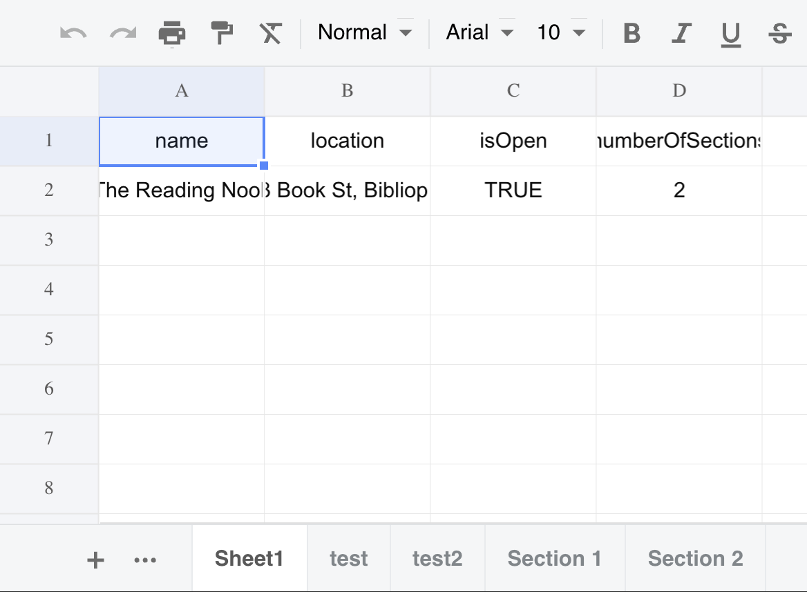

# Main Assignment

##### **Introduction:**

Nested JSON to Excel Conversion Script & JSON creation skill

##### **Dependecy used :**

###### ***xlsx**

*

* version : 0.18.5
*  https://www.npmjs.com/package/xlsx

##### Output :

###### Excel sheet

##### How to use :

* Step 1: Download the package in your sysytem.

* Step 2: Open the folder in your terminal
* Step 3: Run "npm install" on your terminal for installing dependecy
* Step 4: Run "node JsonASG.js" in your teminal then a sheet will be genrated/updated "newExcel.xlsx".
